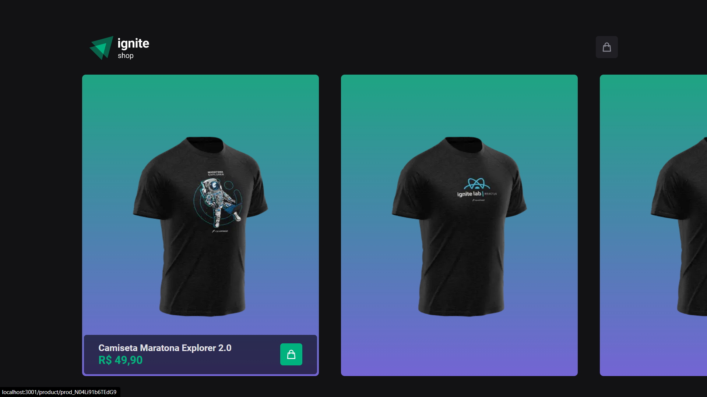
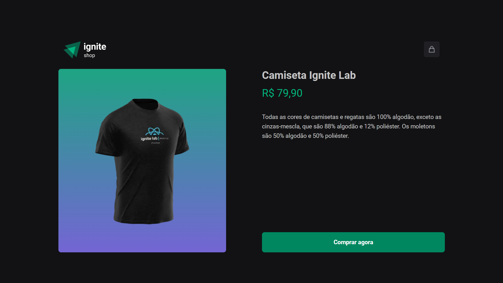
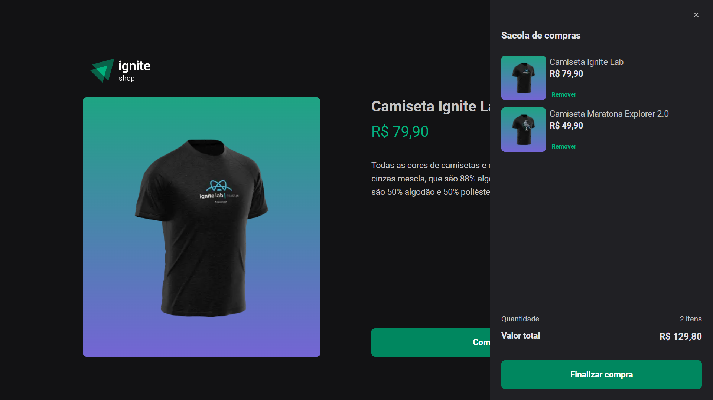
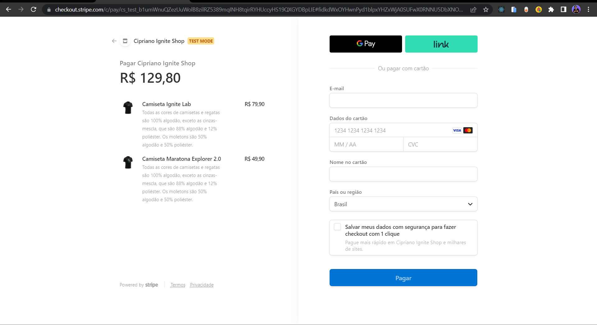
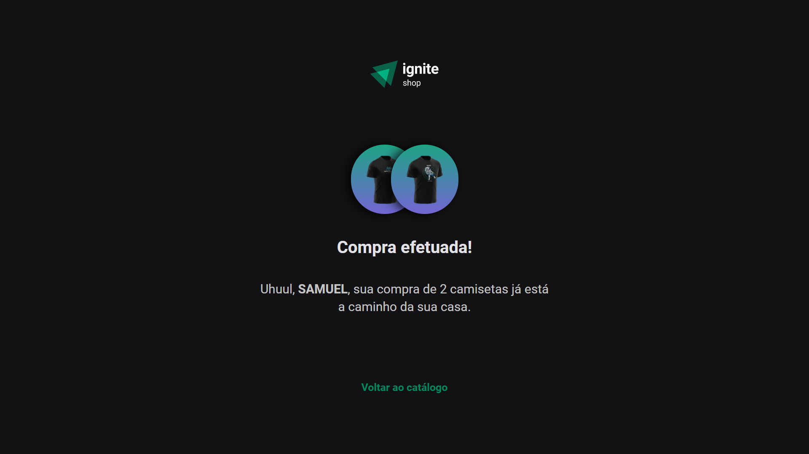

# 🧺 Ignite Shop

## Desafio de código!

Projeto desenvolvido durante a **Especialização no desenvolvimento Front-end** na [Rocketseat](https://www.rocketseat.com.br/).

## Sobre o projeto

Aplicação de loja online de camisetas desenvolvida com NextJs, TypeScript, Stitches (CSS-in-JS) integrada com a plataforma Stripe.

## Funcionalidades

Nesta aplicação pode-se visualizar e adicionar à sacola de compras quantas camisas desejar e preencher os dados para pagamento.

## Techs utilizadas

- [NextJs](https://nextjs.org/)
- [TypeScript](https://www.typescriptlang.org/)
- [Stitches](https://stitches.dev/)
- [Stripe](https://stripe.com/)
- [Git](https://git-scm.com/)

## Telas da aplicação

- Tela inicial
  

- Produto
  

- Sacola
  
- Tela de pagamento no Stripe
  

- Pedido concluído com sucesso
  
